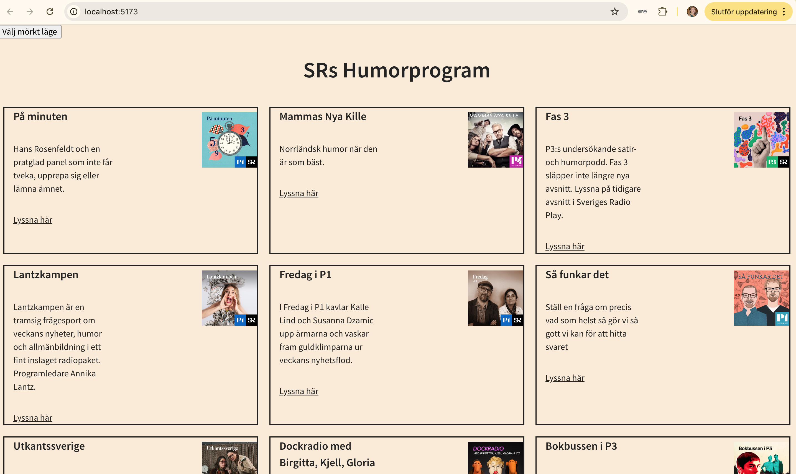
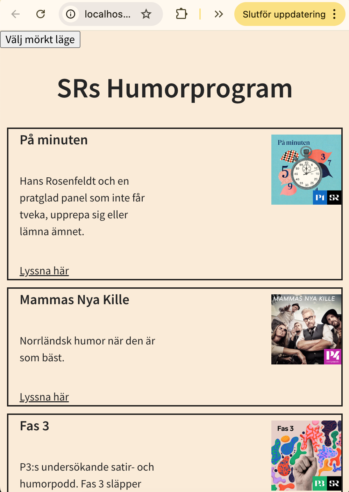
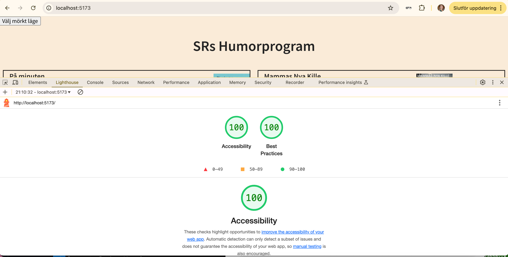

# Fixing Someone Else's Code  

In school, I received an assignment to fix someone else's broken code.  

## My Biggest Challenges...  

- Figuring out which folders needed to be removed  
- Understanding why certain folders were included  
- Getting my `.env` file to work—it kept throwing errors  

## What I Learned...  

- I learned how to manage and use environment variables via `.env` files and `import.meta.env.` Even though it didn't work perfectly in the end, I now understand how to approach it.  
- Using TypeScript to write more robust and readable code.  

## Technologies Used  

The following technologies and tools were used in this project:  

  
  
  
  

## Code Quality  

In this project, I used ESLint to ensure a consistent coding style and avoid common mistakes. This makes the code easier to read and maintain.  

## Getting Started  

### 1. Clone the repository from GitHub  
### 2. Open the terminal  
### 3. Install dependencies  
### 4. Start the development server
 - npm install
### 5. Follow the link in the terminal to access the website
### 6. To run the project, you need a URL from .env.example

---
## Final Project

---
## Lighthouse Analysis

---
## Checklist

- [X] Get the project working
- [X] Convert CSS to Sass
- [X] Ensure consistent naming in CSS
- [X] Convert to TypeScript
- [X] Maintain consistent code quality
- [X] Improve mobile view
- [X] Adjust language settings
- [X] Clean up logging
- [X] Write documentation
- [X] Improve accessibility (images)
- [X] Refactor functions
- [X] Remove unnecessary code
- [X] Remove unused dependencies
- [X] Perform a Lighthouse analysis
- [X] Publish the site on GitHub Pages

